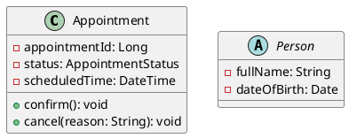
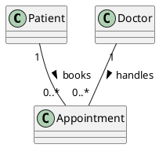
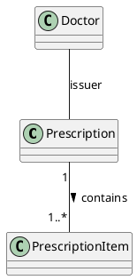
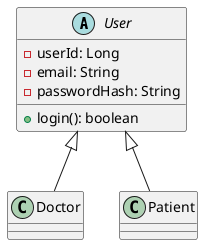
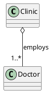
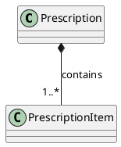
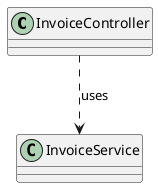

# Hướng dẫn mô hình hóa Class Diagram theo 3 cấp độ: Ký pháp – Cú pháp – Ngữ nghĩa

> Áp dụng cho dự án ECMS (SWP391). Tham khảo: [What is Class Diagram? – Visual Paradigm](https://www.visual-paradigm.com/guide/uml-unified-modeling-language/what-is-class-diagram/). Tài liệu này là phần bổ sung, đi cùng với *ECMS_Sequence_Diagram_Modeling_Guide.md* — Class Diagram mô tả cấu trúc tĩnh (static structure), còn Sequence Diagram mô tả hành vi động (dynamic behavior) gọi tới các operation đã khai báo ở đây.

---

## 1. Vì sao cần khung 3 cấp độ?

Giống như Sequence Diagram, mỗi ký hiệu trong Class Diagram được hiểu đầy đủ qua 3 khía cạnh:

| Cấp độ | Câu hỏi trả lời | Nội dung |
|---|---|---|
| **Ký pháp (Notation)** | "Vẽ như thế nào?" | Hình khối, đường nét, mũi tên đại diện cho phần tử trên diagram |
| **Cú pháp (Syntax)** | "Được phép viết/kết hợp như thế nào?" | Quy tắc cấu trúc: thứ tự các phần trong một class, ký hiệu visibility, cách viết multiplicity |
| **Ngữ nghĩa (Semantics)** | "Có nghĩa là gì trong hệ thống thực / trong code?" | Class tương ứng với gì trong code (object, table), quan hệ tương ứng với gì (con trỏ, khóa ngoại, vòng đời) |

Lỗi phổ biến nhất của người mới học là **nhầm Association – Aggregation – Composition** vì ký pháp khá giống nhau (đều là đường nối) nhưng ngữ nghĩa về vòng đời (lifecycle) hoàn toàn khác nhau — bảng dưới sẽ làm rõ điểm này.

### Quan hệ với Sequence Diagram (xem thêm `ECMS_Sequence_Diagram_Modeling_Guide.md`)

- Mỗi **Lifeline** trong Sequence Diagram = instance của một **Class** ở đây.
- Mỗi **Message đồng bộ** = gọi một **Operation** đã khai báo trong class đó.
- Mỗi **Create Message** = constructor của class.
- **Attribute** thường không xuất hiện trực tiếp trên Sequence Diagram, nhưng được tham chiếu trong **guard condition** (ví dụ `[stockQuantity < 10]` dựa trên attribute `stockQuantity` của class `Medicine`).

---

## 2. Bảng ký hiệu chi tiết

### 2.1. Class (Lớp)

| Cấp độ | Nội dung |
|---|---|
| **Ký pháp** | Hình chữ nhật chia 3 ngăn dọc: **Tên lớp** (ngăn 1) / **Attributes** (ngăn 2) / **Operations** (ngăn 3) |
| **Cú pháp** | Tên lớp viết hoa chữ đầu (PascalCase), đặt giữa ngăn 1; nếu là abstract class thì tên viết *in nghiêng (italics)*; ngăn attribute/operation có thể ẩn (hidden) nếu không cần chi tiết ở mức tổng quan |
| **Ngữ nghĩa** | Một class mô tả một nhóm object có cùng cấu trúc (attributes) và hành vi (operations) — trong ECMS tương ứng với một bảng trong CSDL (ví dụ `Appointment`, `Patient`) hoặc một service/controller trong code |

**Ví dụ:**


**Lỗi thường gặp:**
- Tên class đặt theo động từ ("BookingAppointment") thay vì danh từ — class luôn đại diện cho một *thực thể/khái niệm*, không phải hành động.
- Quên in nghiêng tên abstract class (ví dụ `Person` nếu không thể tạo instance trực tiếp) — sai ký pháp, khiến reviewer không phân biệt được class trừu tượng và class cụ thể.
- Đưa các trường suy ra được (derived/computed) như attribute thường mà không đánh dấu `/` phía trước — ví dụ `/age` (tính từ `dateOfBirth`) cần ký hiệu derived attribute để phân biệt với attribute lưu trữ thật.

---

### 2.2. Attribute (Thuộc tính)

| Cấp độ | Nội dung |
|---|---|
| **Ký pháp** | Dòng văn bản trong ngăn 2, cú pháp `visibility name : Type [= defaultValue]` |
| **Cú pháp** | Visibility (`+ - # ~`) đặt trước tên; dấu `:` ngăn cách tên và kiểu dữ liệu; có thể có giá trị mặc định sau dấu `=` |
| **Ngữ nghĩa** | Attribute mô tả **trạng thái (state)** mà object "biết" — tương ứng với field/member variable trong code, hoặc column trong bảng CSDL |

**Ví dụ:**
```
- stockQuantity: int = 0
+ medicineName: String
# expiryDate: Date
```

**Lỗi thường gặp:**
- Quên kiểu dữ liệu (chỉ viết `stockQuantity` mà không có `: int`) — thiếu thông tin để sinh code/schema CSDL.
- Đặt attribute là `public (+)` cho dữ liệu nhạy cảm (ví dụ `passwordHash`) trong khi nghiệp vụ yêu cầu bảo mật — nên dùng `private (-)` hoặc `protected (#)` đúng theo NFR Security của ECMS.

---

### 2.3. Operation (Phương thức)

| Cấp độ | Nội dung |
|---|---|
| **Ký pháp** | Dòng văn bản trong ngăn 3, cú pháp `visibility name(param: Type, ...) : ReturnType` |
| **Cú pháp** | Tham số viết trong dấu `()`, mỗi tham số có dạng `tên: Kiểu`; kiểu trả về đặt sau dấu `:` ở cuối; nếu không trả về gì, có thể bỏ qua hoặc ghi `void` |
| **Ngữ nghĩa** | Operation mô tả **hành vi (behavior)** mà object "làm được" — tương ứng với method trong code; mỗi operation ở đây **phải khớp 1:1** với mỗi synchronous/create message gọi tới class này trong Sequence Diagram |

**Ví dụ:**
```
+ confirmAppointment(appointmentId: Long): Appointment
+ dispenseFromBatch(batchId: Long, quantity: int): void
- calculateTotal(): BigDecimal
```

**Lỗi thường gặp:**
- Operation trong Class Diagram không khớp tên/tham số với message trong Sequence Diagram (ví dụ Class Diagram ghi `createAppointment()` nhưng Sequence Diagram gọi `addAppointment()`) — hai diagram lệch nhau, gây lỗi khi sinh code.
- Khai báo operation `public (+)` cho các hàm chỉ dùng nội bộ (helper method) — nên là `private (-)`/`protected (#)`, đúng nguyên tắc encapsulation.

---

### 2.4. Visibility (Tính khả kiến): `+ - # ~`

| Ký hiệu | Ý nghĩa | Phạm vi truy cập |
|---|---|---|
| `+` | public | Mọi class đều truy cập được |
| `-` | private | Chỉ class chứa nó truy cập được |
| `#` | protected | Class chứa nó + các class con (derived class) |
| `~` | package | Các class trong cùng package |

| Cấp độ | Nội dung |
|---|---|
| **Ký pháp** | Một trong 4 ký tự đặt **ngay trước** tên attribute/operation, không có khoảng trắng |
| **Cú pháp** | Bắt buộc phải chọn đúng 1 trong 4 ký hiệu; áp dụng riêng cho từng attribute/operation (không gán chung cho cả class) |
| **Ngữ nghĩa** | Quyết định ai được phép đọc/gọi attribute hoặc operation đó — ánh xạ trực tiếp tới access modifier trong Java (`public/private/protected/package-private`) |

**Lỗi thường gặp:**
- Để toàn bộ attribute là `public (+)` "cho tiện" — vi phạm nguyên tắc encapsulation, đồng thời mâu thuẫn với rule BR-08 (EMR Confidentiality) của ECMS yêu cầu kiểm soát truy cập dữ liệu chặt.
- Nhầm `#` (protected) với `~` (package) — hai mức này có phạm vi khác nhau rõ ràng (protected còn cho derived class ở package khác, package thì không).

---

### 2.5. Association (Liên kết)

| Cấp độ | Nội dung |
|---|---|
| **Ký pháp** | Đường thẳng liền nét nối 2 class, có thể có tên quan hệ ở giữa và mũi tên nhỏ chỉ hướng đọc (navigability) |
| **Cú pháp** | Hai đầu đường có thể ghi **role name**, **multiplicity**; mũi tên navigability (nếu có) chỉ hướng truy vấn được phép |
| **Ngữ nghĩa** | Một liên kết cấu trúc (structural link) giữa 2 class ngang hàng (peer), không có ý nghĩa "phần của" — hai object có vòng đời **độc lập hoàn toàn** với nhau |

**Ví dụ (UC-12 Manage Appointment):**


**Lỗi thường gặp:**
- Không ghi multiplicity ở 2 đầu — thiếu thông tin quan trọng về cardinality (1-1, 1-n, n-n), khiến không thể sinh đúng khóa ngoại/bảng trung gian khi thiết kế CSDL.
- Vẽ mũi tên navigability ở cả 2 đầu trong khi nghiệp vụ chỉ cần truy vấn một chiều — gây hiểu sai khả năng truy vấn ngược.

---

### 2.6. Multiplicity (Số lượng tham gia)

| Ký hiệu | Ý nghĩa |
|---|---|
| `1` | Đúng một |
| `0..1` | Không hoặc một |
| `*` hoặc `0..*` | Nhiều (0 hoặc nhiều) |
| `1..*` | Một hoặc nhiều |
| `3..4` | Một khoảng cụ thể |

| Cấp độ | Nội dung |
|---|---|
| **Ký pháp** | Số/ký hiệu đặt gần đầu đường association, sát phía class đối diện |
| **Cú pháp** | Viết theo dạng `min..max`; `*` đại diện cho "không xác định/nhiều" |
| **Ngữ nghĩa** | Cho biết tại một thời điểm có bao nhiêu instance của class bên này liên kết với một instance của class bên kia — quyết định cách thiết kế khóa ngoại/bảng trung gian trong CSDL |

**Ví dụ (BR-03 Max 30 appointments/doctor/day — đây là business rule, multiplicity chỉ thể hiện cardinality chung `0..*`, ràng buộc số 30 cần ghi chú riêng, không thể hiện bằng multiplicity):**
```
Doctor "1" -- "0..*" Appointment
```

**Lỗi thường gặp:**
- Nhầm vị trí ghi multiplicity (ghi multiplicity của `Doctor` ở phía gần `Appointment` và ngược lại) — multiplicity luôn đặt **gần class mà số đó áp dụng cho**, tức là số lượng instance của chính class đó tham gia liên kết.
- Dùng multiplicity để diễn tả ràng buộc nghiệp vụ phức tạp (ví dụ "tối đa 30 lịch/ngày") — multiplicity chỉ thể hiện cardinality tĩnh, ràng buộc động theo thời gian (per day) phải ghi bằng constraint `{...}` hoặc business rule riêng, không gán trực tiếp vào multiplicity.

---

### 2.7. Relationship Name & Role (Tên quan hệ & Vai trò)

| Cấp độ | Nội dung |
|---|---|
| **Ký pháp** | Tên quan hệ ghi giữa đường association, có thể kèm mũi tên nhỏ chỉ hướng đọc; role name ghi gần đầu đường, sát mỗi class |
| **Cú pháp** | Tên quan hệ nên là **động từ/cụm động từ** đọc xuôi theo hướng mũi tên; role name là **danh từ** mô tả vai trò của class đó trong quan hệ |
| **Ngữ nghĩa** | Giúp người đọc hiểu *bản chất* của liên kết khi đọc thành câu, ví dụ "mỗi Prescription chứa nhiều PrescriptionItem" |

**Ví dụ:**


**Lỗi thường gặp:**
- Đặt tên quan hệ là danh từ ("Relationship1") không đọc được thành câu có nghĩa — mất giá trị mô tả nghiệp vụ.
- Quên mũi tên chỉ hướng đọc khi tên quan hệ có thể đọc theo 2 chiều với nghĩa khác nhau, gây mơ hồ.

---

### 2.8. Generalization / Inheritance (Tổng quát hóa / Kế thừa)

| Cấp độ | Nội dung |
|---|---|
| **Ký pháp** | Đường thẳng liền nét, đầu mũi tên **hình tam giác rỗng (hollow triangle)**, chỉ từ class con vào class cha |
| **Cú pháp** | Class cha (superclass) đặt phía đầu mũi tên; nếu class cha không thể tạo instance trực tiếp, tên class cha phải in nghiêng (abstract) |
| **Ngữ nghĩa** | Quan hệ "**is-a**" — class con kế thừa toàn bộ attribute + operation của class cha, có thể override hoặc bổ sung thêm |

**Ví dụ (User – Role hierarchy của ECMS: Admin, Manager, Doctor, Receptionist, Pharmacist, Patient, Lab Technician đều kế thừa từ User):**


**Lỗi thường gặp:**
- Vẽ ngược hướng mũi tên (từ class cha chỉ vào class con) — sai ký pháp UML, mũi tên generalization **luôn** chỉ từ con lên cha (giống "is-a-kind-of" hướng lên).
- Dùng Generalization khi thực ra chỉ là Association — ví dụ "Doctor có specialization là Ophthalmology" không phải kế thừa, mà chỉ là attribute hoặc association tới class `Specialization`.
- Lạm dụng kế thừa nhiều tầng không cần thiết (deep inheritance) khi composition sẽ linh hoạt hơn (theo nguyên tắc "favor composition over inheritance").

---

### 2.9. Aggregation (Tập hợp — "consists-of"/"has-a", vòng đời độc lập)

| Cấp độ | Nội dung |
|---|---|
| **Ký pháp** | Đường thẳng liền nét, đầu **hình thoi rỗng (hollow/unfilled diamond)** đặt tại class tổng thể (whole), nối tới class thành phần (part) |
| **Cú pháp** | Hình thoi đặt ở đầu class "whole"; multiplicity vẫn ghi như Association thông thường |
| **Ngữ nghĩa** | Quan hệ "**part-of**" nhưng object phần (part) có thể **tồn tại độc lập**, không bị hủy khi object tổng thể (whole) bị hủy |

**Ví dụ:**

> Một Doctor vẫn "tồn tại" (vẫn là một người, vẫn có hồ sơ) dù không còn thuộc Clinic này nữa (ví dụ chuyển sang phòng khám khác) — đây là lý do dùng Aggregation thay vì Composition.

**Lỗi thường gặp:**
- Vẽ hình thoi đặc (filled) thay vì rỗng (hollow) — nhầm với Composition, sai hoàn toàn về ngữ nghĩa vòng đời.
- Dùng Aggregation cho quan hệ mà thực chất 2 bên hoàn toàn độc lập, không có ý nghĩa "phần-tổng thể" nào — trường hợp này chỉ nên dùng Association đơn giản.

---

### 2.10. Composition (Hợp thành — vòng đời phụ thuộc)

| Cấp độ | Nội dung |
|---|---|
| **Ký pháp** | Đường thẳng liền nét, đầu **hình thoi đặc (filled diamond)** đặt tại class tổng thể (whole) |
| **Cú pháp** | Tương tự Aggregation về vị trí, nhưng hình thoi phải tô đen/đặc |
| **Ngữ nghĩa** | Quan hệ "part-of" **mạnh**: object phần (part) **không thể tồn tại** nếu không có object tổng thể (whole); khi whole bị hủy, toàn bộ part cũng bị hủy theo (cùng vòng đời) |

**Ví dụ (Prescription – PrescriptionItem):**

> Một `PrescriptionItem` (dòng thuốc trong đơn) không có ý nghĩa tồn tại độc lập nếu `Prescription` (đơn thuốc) đó không tồn tại — đúng bản chất Composition.

**Lỗi thường gặp:**
- Dùng Composition cho `Doctor`–`Clinic` (như ví dụ Aggregation ở trên) — sai vì Doctor vẫn tồn tại độc lập, không "chết theo" Clinic.
- Theo BR-09 (No Hard Delete) của ECMS: Composition về mặt khái niệm vẫn đúng (PrescriptionItem phụ thuộc logic vào Prescription), nhưng khi triển khai vào CSDL, "hủy" ở đây nên hiểu là cascade theo trạng thái deactivate logic, không phải xóa vật lý — cần ghi chú rõ trong tài liệu đặc tả kèm theo diagram để tránh lập trình viên hiểu nhầm thành `DELETE CASCADE` vật lý.

---

### 2.11. Dependency (Phụ thuộc)

| Cấp độ | Nội dung |
|---|---|
| **Ký pháp** | Đường **đứt nét (dashed line)**, đầu mũi tên hở (open arrow), chỉ từ class phụ thuộc tới class bị phụ thuộc |
| **Cú pháp** | Có thể ghi stereotype `«use»`, `«import»`... phía trên đường đứt nét nếu cần làm rõ loại phụ thuộc |
| **Ngữ nghĩa** | Khi class bị chỉ tới thay đổi định nghĩa (signature, structure), class phụ thuộc **có thể** phải thay đổi theo — nhưng **không phải lúc nào cũng đúng chiều ngược lại** |

**Ví dụ:**


**Lỗi thường gặp:**
- Vẽ đường liền nét (solid) cho Dependency — sai ký pháp, Dependency luôn là đường đứt nét, để phân biệt rõ với Association/Aggregation/Composition (đều là quan hệ cấu trúc lâu dài).
- Vẽ Dependency hai chiều (2 mũi tên) khi thực tế chỉ một bên phụ thuộc — vi phạm chính định nghĩa "not the other way around" của Dependency.

---

### 2.12. Navigability (Khả năng truy vấn)

| Cấp độ | Nội dung |
|---|---|
| **Ký pháp** | Mũi tên nhỏ ở một đầu (hoặc cả hai đầu, hoặc không đầu nào) của đường Association |
| **Cú pháp** | Có mũi tên ở đầu nào thì có thể "đi từ đầu kia tới đầu có mũi tên"; không có mũi tên ở cả 2 đầu nghĩa là chưa xác định/đi được cả 2 chiều (tùy convention nhóm) |
| **Ngữ nghĩa** | Cho biết: với một instance ở đầu A, có lấy được tập các instance liên quan ở đầu B không (ví dụ tương ứng việc class A có giữ list reference tới B hay không trong code) |

**Ví dụ (theo đúng minh họa gốc trong tài liệu Visual Paradigm): Spreadsheet → Cell có navigability một chiều — từ Spreadsheet biết được các Cell, nhưng từ một Cell không xác định được nó thuộc Spreadsheet nào nếu không có thuộc tính ngược lại.**

**Lỗi thường gặp:**
- Mặc định coi mọi Association là 2 chiều truy vấn được — trong code thực tế (ví dụ JPA `@OneToMany`/`@ManyToOne`), việc có giữ reference ngược hay không ảnh hưởng trực tiếp tới hiệu năng truy vấn (N+1 query); cần xác định rõ navigability ngay từ Class Diagram.

---

### 2.13. Note (Chú thích) trên Class Diagram

| Cấp độ | Nội dung |
|---|---|
| **Ký pháp** | Hình chữ nhật góc gấp (dog-eared), màu xám, nối bằng đường đứt nét tới class/relationship liên quan |
| **Cú pháp** | Không ảnh hưởng cấu trúc; chỉ là văn bản tự do |
| **Ngữ nghĩa** | Giải thích bổ sung, ví dụ ghi chú về constraint nghiệp vụ không thể hiện được bằng ký hiệu chuẩn (ví dụ business rule BR-03, BR-07...) |

**Lỗi thường gặp:**
- Dùng Note để mô tả một relationship còn thiếu (ví dụ "Patient cũng liên kết với Invoice" viết trong Note) thay vì vẽ relationship thật — Note chỉ nên bổ sung diễn giải, không thay thế cho ký hiệu cấu trúc chính thức.

---

## 3. Bảng so sánh nhanh: Association vs Aggregation vs Composition vs Generalization vs Dependency

| Quan hệ | Ký pháp | Vòng đời 2 bên | Ngữ nghĩa cốt lõi |
|---|---|---|---|
| Association | Đường liền nét, không hình thoi/tam giác | Độc lập hoàn toàn | Liên kết cấu trúc ngang hàng |
| Aggregation | Đường liền nét + hình thoi **rỗng** ở "whole" | Độc lập (part sống được khi whole mất) | "part-of" lỏng |
| Composition | Đường liền nét + hình thoi **đặc** ở "whole" | Phụ thuộc (part chết theo whole) | "part-of" chặt |
| Generalization | Đường liền nét + tam giác **rỗng** chỉ vào class cha | Class con kế thừa cha | "is-a" |
| Dependency | Đường **đứt nét** + mũi tên hở | Một chiều, lỏng | "uses/depends-on" |

---

## 4. Liên kết với 3 góc nhìn (perspective) theo SDLC

Theo Visual Paradigm, Class Diagram có thể được vẽ ở 3 góc nhìn tùy giai đoạn:

| Góc nhìn | Mục đích | Áp dụng trong ECMS |
|---|---|---|
| **Conceptual** | Mô tả khái niệm miền nghiệp vụ, không phụ thuộc ngôn ngữ lập trình | Domain model ban đầu trong SRS/RDS (Patient, Appointment, Prescription...) |
| **Specification** | Mô tả interface/abstraction của phần mềm, chưa cam kết implementation | Class Diagram trong SDS, dùng làm input để thiết kế Sequence Diagram |
| **Implementation** | Mô tả đúng theo công nghệ cụ thể | Entity class JPA thật trong package `entity/`, gắn annotation `@Entity`, `@OneToMany`... |

**Lỗi thường gặp:** trộn lẫn 3 góc nhìn trong cùng 1 diagram (ví dụ vừa có khái niệm nghiệp vụ trừu tượng vừa có chi tiết kiểu dữ liệu Java cụ thể như `List<PrescriptionItem>`) khiến diagram không rõ đang ở giai đoạn thiết kế nào — nên tách riêng diagram theo từng góc nhìn, đặc biệt khi nộp báo cáo SWP391 cần phân biệt rõ Conceptual Class Diagram (cho SRS) và Detailed/Implementation Class Diagram (cho SDS).

---

## 5. Checklist tự kiểm tra trước khi nộp Class Diagram

1. Mỗi attribute/operation có khai báo đầy đủ visibility + kiểu dữ liệu?
2. Abstract class đã in nghiêng tên chưa?
3. Mỗi association có multiplicity ở cả 2 đầu, đặt đúng vị trí?
4. Đã phân biệt đúng Aggregation (hình thoi rỗng) và Composition (hình thoi đặc) dựa trên vòng đời thực tế, không chỉ "có vẻ giống part-of"?
5. Generalization có vẽ đúng hướng (tam giác rỗng chỉ từ con lên cha)?
6. Dependency có dùng đường đứt nét, không nhầm với Association?
7. Mỗi operation ở đây có khớp 1:1 với message tương ứng trong Sequence Diagram (xem `ECMS_Sequence_Diagram_Modeling_Guide.md`)?
8. Các business rule không thể hiện bằng ký hiệu chuẩn (BR-03, BR-07, BR-09...) đã được ghi chú rõ bằng Note hoặc constraint `{...}`, không bị bỏ sót?
9. Diagram đang ở đúng 1 góc nhìn (Conceptual/Specification/Implementation), không trộn lẫn?
