# Hướng dẫn mô hình hóa Sequence Diagram theo 3 cấp độ: Ký pháp – Cú pháp – Ngữ nghĩa

> Áp dụng cho dự án ECMS (SWP391). Tài liệu này dùng để thiết kế chi tiết (detailed design) cho từng Use Case, làm cầu nối từ Use Case Specification sang Class Diagram (operations của class chính là các message trong Sequence Diagram).

---

## 1. Vì sao cần khung 3 cấp độ?

Theo đặc tả UML của OMG, mỗi phần tử mô hình (model element) luôn được định nghĩa qua 3 khía cạnh độc lập nhưng liên quan chặt:

| Cấp độ | Câu hỏi trả lời | Nội dung |
|---|---|---|
| **Ký pháp (Notation)** | "Vẽ như thế nào?" | Hình vẽ, đường nét, ký hiệu trực quan đại diện cho phần tử trên diagram |
| **Cú pháp (Syntax)** | "Được phép kết hợp như thế nào?" | Quy tắc cấu trúc: phần tử này được đặt ở đâu, nối với gì, lồng vào đâu là hợp lệ |
| **Ngữ nghĩa (Semantics)** | "Có nghĩa là gì khi hệ thống chạy?" | Hành vi thực tế mà ký hiệu đó mô tả trong luồng thực thi (runtime behavior) |

Một lỗi rất phổ biến của người mới học UML là **chỉ học ký pháp** (nhớ hình vẽ) mà không hiểu cú pháp/ngữ nghĩa — dẫn tới vẽ "đúng hình" nhưng "sai ý nghĩa nghiệp vụ". Bảng dưới đây tách riêng 3 cấp độ cho từng ký hiệu để tránh tình trạng đó.

### Quan hệ với Class Diagram (detailed design)

Theo tài liệu Visual Paradigm về Class Diagram: mỗi class có **attributes** (structural features – "biết gì") và **operations** (behavioral features – "làm được gì"). Khi vẽ Sequence Diagram ở mức detailed design:

- Mỗi **Lifeline** = một instance của một **Class** đã có trong Class Diagram (hoặc instance của Actor/Boundary/Control/Entity nếu dùng kiến trúc 3-layer).
- Mỗi **Message đồng bộ (synchronous message)** = lời gọi một **operation** đã khai báo trong class đó (đúng tên, đúng tham số, đúng kiểu trả về).
- Nếu trong Sequence Diagram xuất hiện một message gọi tới operation **chưa có** trong Class Diagram → đây là dấu hiệu Class Diagram đang thiếu, cần bổ sung operation đó (`+ operationName(param: Type): ReturnType`).
- **Return message** ứng với kiểu trả về (return type) của operation.
- **Create message** ứng với constructor của class (entry trong Class Notation phần Operations).
- **Self-message** thường ứng với một private/protected operation (`-`/`#`) được gọi nội bộ trong class đó — đây cũng là một gợi ý tốt để xác định visibility khi vẽ Class Diagram.

→ Vì vậy, Sequence Diagram không chỉ minh họa luồng nghiệp vụ mà còn là **nguồn kiểm chứng (validation source)** cho tính đầy đủ và đúng đắn của Class Diagram.

---

## 2. Bảng ký hiệu chi tiết

### 2.1. Lifeline (Đường đời)

| Cấp độ | Nội dung |
|---|---|
| **Ký pháp** | Hình chữ nhật ở đầu (header) ghi `tên đối tượng : Tên lớp` hoặc `: Tên lớp` (nếu ẩn danh), kèm đường đứt nét (dashed line) kéo dài xuống dưới |
| **Cú pháp** | Header phải đặt trên cùng frame; tên có thể bỏ qua nhưng dấu `:` trước tên lớp là bắt buộc nếu muốn chỉ rõ kiểu; mỗi lifeline đại diện cho **một và chỉ một** instance trong phạm vi tương tác đó |
| **Ngữ nghĩa** | Biểu diễn sự tồn tại của một participant (object/actor/component) theo thời gian, từ lúc được tạo (hoặc từ đầu diagram) đến lúc bị hủy (hoặc hết diagram) |

**Ví dụ (PlantUML):**
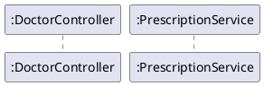

**Lỗi thường gặp:**
- Đặt tên lifeline trùng tên Class nhưng viết hoa/thường không nhất quán với Class Diagram → mất khả năng truy vết (traceability).
- Vẽ một lifeline đại diện cho "nhiều instance cùng loại" (ví dụ dùng 1 lifeline `:PrescriptionItem` để chỉ chung "các item") — sai ngữ nghĩa, vì lifeline luôn là 1 instance cụ thể; muốn biểu diễn nhiều instance phải dùng `loop` quanh message gửi tới cùng 1 lifeline, hoặc nhân bản lifeline.
- Quên dấu `:` khi không đặt tên riêng (viết `DoctorController` thay vì `:DoctorController`), khiến người đọc hiểu nhầm đó là tên class chứ không phải instance.

---

### 2.2. Actor trên Sequence Diagram

| Cấp độ | Nội dung |
|---|---|
| **Ký pháp** | Hình người que (stick figure) đặt làm lifeline ngoài cùng bên trái |
| **Cú pháp** | Actor chỉ được gửi/nhận message ở biên ngoài của hệ thống (thường là message tới Boundary class); không được là target của internal call nội bộ hệ thống |
| **Ngữ nghĩa** | Đại diện cho người dùng/hệ thống ngoài khởi tạo luồng tương tác (ví dụ: Patient, Receptionist, Doctor) |

**Ví dụ:**
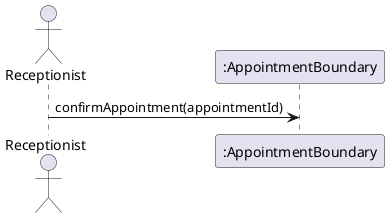

**Lỗi thường gặp:**
- Để Actor gửi message trực tiếp tới Entity/Control class, bỏ qua Boundary — phá vỡ nguyên tắc phân tầng (layering) đã thiết lập trong kiến trúc BCE (Boundary-Control-Entity), gây khó maintain.
- Vẽ nhiều Actor cùng tham gia một sequence diagram nhưng không làm rõ actor nào khởi tạo luồng (initiator) — gây nhầm lẫn khi đọc luồng.

---

### 2.3. Execution Specification / Activation Bar (Thanh kích hoạt)

| Cấp độ | Nội dung |
|---|---|
| **Ký pháp** | Hình chữ nhật hẹp, dọc theo lifeline, thể hiện khoảng thời gian một thao tác đang được thực thi |
| **Cú pháp** | Activation bar chỉ tồn tại sau khi nhận một message gọi (incoming message) và phải kết thúc trước hoặc cùng lúc với return message tương ứng; có thể lồng (nested) activation bar khi self-call |
| **Ngữ nghĩa** | Biểu diễn khoảng thời gian một method/operation đang chạy trên call stack của đối tượng đó |

**Ví dụ:**
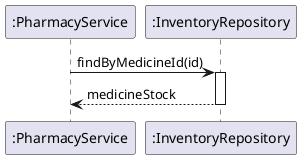

**Lỗi thường gặp:**
- Vẽ activation bar kéo dài suốt toàn bộ sequence diagram cho mọi đối tượng — sai vì thực tế method chỉ "đang chạy" trong khoảng thời gian xử lý request đó, không phải toàn bộ vòng đời lifeline.
- Quên `deactivate`/return khiến activation bar "treo" mãi — không khớp với nguyên tắc một lời gọi luôn phải kết thúc (trả điều khiển) trước khi đối tượng gọi tiếp tục.

---

### 2.4. Message đồng bộ (Synchronous Message)

| Cấp độ | Nội dung |
|---|---|
| **Ký pháp** | Mũi tên liền nét, đầu mũi tên đặc (filled arrowhead) `——▶` |
| **Cú pháp** | Bên gửi phải **chờ** bên nhận xử lý xong và trả lời (implicit hoặc explicit return) trước khi tiếp tục; tên message theo cú pháp `tênOperation(tênTham số: Kiểu)` khớp với operation signature trong Class Diagram |
| **Ngữ nghĩa** | Tương đương lời gọi hàm/phương thức thông thường trong code (blocking call) — bên gọi bị "đứng chờ" |

**Ví dụ:**
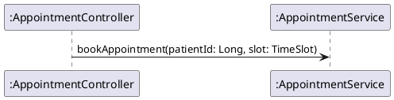

**Lỗi thường gặp:**
- Dùng synchronous message để mô tả việc gửi email/thông báo bất đồng bộ (thực tế nên dùng async message `->>`), khiến diagram ngụ ý sai rằng hệ thống bị block khi gửi email.
- Đặt tên message là danh từ ("Appointment Data") thay vì động từ + tham số ("bookAppointment(...)") — sai cú pháp UML cho message gọi operation.
- Tên message không khớp tên operation trong Class Diagram (ví dụ Class Diagram có `createAppointment()` nhưng Sequence Diagram viết `addAppointment()`) → mất tính nhất quán giữa 2 diagram.

---

### 2.5. Message trả lời (Return Message / Reply Message)

| Cấp độ | Nội dung |
|---|---|
| **Ký pháp** | Mũi tên đứt nét, đầu mũi tên hở (open/dashed arrowhead) `- - ▶`, thường có nhãn là giá trị trả về |
| **Cú pháp** | Chỉ xuất hiện để kết thúc một execution specification đã mở bởi message đồng bộ trước đó; có thể được vẽ ẩn (implicit) nếu return type là `void` |
| **Ngữ nghĩa** | Tương đương câu lệnh `return` trong code, trả quyền điều khiển và (có thể) giá trị về cho bên gọi |

**Ví dụ:**
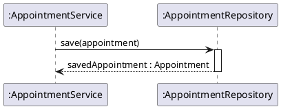

**Lỗi thường gặp:**
- Vẽ return message bằng mũi tên liền nét giống message gọi — vi phạm ký pháp, gây khó phân biệt hướng gọi/hướng trả.
- Quên vẽ return message khi operation trong Class Diagram có khai báo kiểu trả về khác `void` — Sequence Diagram bị thiếu thông tin so với Class Diagram.

---

### 2.6. Message bất đồng bộ (Asynchronous Message)

| Cấp độ | Nội dung |
|---|---|
| **Ký pháp** | Mũi tên liền nét, đầu mũi tên hình que mở (open/stick arrowhead) `——▷` |
| **Cú pháp** | Bên gửi **không chờ** phản hồi, tiếp tục thực thi ngay sau khi gửi; không bắt buộc có execution specification trên lifeline nhận tại đúng thời điểm gửi |
| **Ngữ nghĩa** | Tương đương việc gọi sang một hàng đợi (queue), event, hoặc thread/process khác — non-blocking call |

**Ví dụ (đúng với nghiệp vụ "Send Appointment Reminder Notification" – UC-18):**
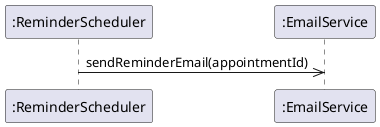

**Lỗi thường gặp:**
- Dùng sai loại mũi tên (đặc thay vì que mở) cho hành vi rõ ràng là bất đồng bộ như cron job gửi email, khiến reviewer hiểu nhầm là hệ thống bị block trong khi gửi mail.
- Vẽ activation bar dài đợi return cho async message — sai ngữ nghĩa vì bản chất async không có "đợi".

---

### 2.7. Create Message

| Cấp độ | Nội dung |
|---|---|
| **Ký pháp** | Mũi tên đồng bộ/bất đồng bộ chỉ tới **đỉnh đầu (header)** của một lifeline mới (lifeline này không bắt đầu từ trên cùng frame mà bắt đầu thấp hơn, đúng tại điểm bị tạo) |
| **Cú pháp** | Tên message thường là `«create»` hoặc tên constructor; lifeline đích phải xuất hiện lần đầu chính tại điểm nhận message này |
| **Ngữ nghĩa** | Tương đương lệnh khởi tạo đối tượng (`new ClassName(...)` trong code) |

**Ví dụ:**
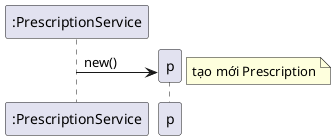

**Lỗi thường gặp:**
- Vẽ lifeline mới xuất hiện từ đầu frame (cùng hàng với các lifeline khác) nhưng thực ra nó được tạo ra giữa luồng — sai cú pháp, làm mất thông tin "khi nào" object được sinh ra.
- Quên ghi `«create»` hoặc không phân biệt được với message thông thường, khiến reviewer không biết đây là constructor call.

---

### 2.8. Destroy Message

| Cấp độ | Nội dung |
|---|---|
| **Ký pháp** | Dấu X lớn tại điểm cuối của lifeline, kèm message tới (có thể) trước đó |
| **Cú pháp** | Sau dấu X, lifeline đó không được xuất hiện thêm bất kỳ message nào (gửi hoặc nhận) |
| **Ngữ nghĩa** | Đối tượng bị giải phóng/hủy (object destroyed), không còn tồn tại để tham gia tương tác tiếp |

**Ví dụ:**
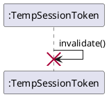

**Lỗi thường gặp:**
- Theo BR-09 của ECMS ("No Hard Delete – không xóa vật lý, chỉ deactivate bằng cờ status"), **không nên** dùng Destroy Message cho các entity nghiệp vụ như Patient, Appointment, Invoice — vì nghiệp vụ thực tế chỉ đổi status, không hủy object/record. Destroy Message chỉ phù hợp cho object tạm trong bộ nhớ (ví dụ session, DTO tạm).
- Vẽ tiếp message từ/đến lifeline đã bị destroy — vi phạm cú pháp UML.

---

### 2.9. Self-Message (Message gửi cho chính mình)

| Cấp độ | Nội dung |
|---|---|
| **Ký pháp** | Mũi tên đi ra rồi quay lại cùng một lifeline (hình chữ U nhỏ cạnh lifeline đó), thường kèm activation bar lồng (nested) |
| **Cú pháp** | Nguồn và đích của message là cùng một lifeline |
| **Ngữ nghĩa** | Đối tượng tự gọi một operation nội bộ của chính nó (thường là private/protected method) |

**Ví dụ:**
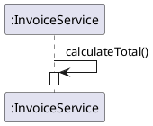

**Lỗi thường gặp:**
- Dùng self-message để biểu diễn việc gọi sang một class khác nhưng vẽ nhầm lifeline (copy-paste lỗi) — gây hiểu sai object boundary.
- Không thấy self-message tương ứng nào với operation `private`/`protected` trong Class Diagram — gợi ý Class Diagram có thể đang thiếu các operation nội bộ hỗ trợ.

---

### 2.10. Found Message & Lost Message

| Cấp độ | Nội dung |
|---|---|
| **Ký pháp** | **Found message**: mũi tên bắt đầu từ một dấu chấm/đường tự do (không có lifeline nguồn) chỉ vào một lifeline. **Lost message**: mũi tên xuất phát từ một lifeline nhưng kết thúc tại dấu chấm tự do (không có lifeline đích) |
| **Cú pháp** | Không yêu cầu xác định lifeline nguồn (found) hoặc lifeline đích (lost); thường dùng khi nguồn/đích nằm ngoài phạm vi diagram |
| **Ngữ nghĩa** | Found: tương tác bắt đầu từ một nguồn không được mô hình hóa (ví dụ request HTTP từ client ngoài hệ thống). Lost: message gửi đi nhưng không quan tâm/không theo dõi nơi nhận (ví dụ fire-and-forget log) |

**Ví dụ:**
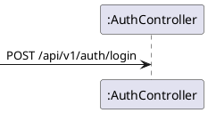

**Lỗi thường gặp:**
- Lạm dụng found/lost message để "trốn" việc xác định actor/đối tượng thực sự liên quan — làm giảm giá trị truy vết của diagram. Trong detailed design cho use case nội bộ, nên ưu tiên xác định rõ actor làm lifeline thật.

---

### 2.11. Combined Fragment — `alt` (Alternative / rẽ nhánh)

| Cấp độ | Nội dung |
|---|---|
| **Ký pháp** | Khung chữ nhật có nhãn `alt` ở góc trên-trái (pentagon nhỏ), chia thành nhiều ngăn (region) bằng đường đứt nét ngang, mỗi ngăn có **guard condition** `[điều kiện]` |
| **Cú pháp** | Mỗi region phải có guard `[...]`; các guard nên **loại trừ nhau (mutually exclusive)**; chỉ một region được thực thi tại runtime |
| **Ngữ nghĩa** | Tương đương cấu trúc `if / else if / else` trong code |

**Ví dụ (UC-14 Confirm Appointment):**
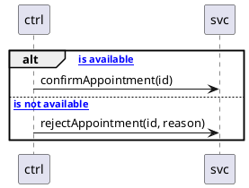

**Lỗi thường gặp:**
- Guard condition để trống hoặc viết mơ hồ ("trường hợp khác") thay vì biểu thức boolean rõ ràng gắn với dữ liệu nghiệp vụ thực ("slotAvailable == false").
- Hai guard chồng lấp nhau (cả hai cùng đúng tại một thời điểm) — vi phạm ngữ nghĩa "chỉ chọn một nhánh" của `alt`.
- Dùng `alt` chỉ với 1 nhánh (không có `else`) trong khi đáng ra phải dùng `opt` (xem 2.12).

---

### 2.12. Combined Fragment — `opt` (Optional)

| Cấp độ | Nội dung |
|---|---|
| **Ký pháp** | Khung `opt` chỉ có **một region duy nhất**, kèm guard `[...]` |
| **Cú pháp** | Không có nhánh else; chỉ một guard điều kiện |
| **Ngữ nghĩa** | Tương đương `if (condition) { ... }` không có else — đoạn message bên trong chỉ thực thi khi điều kiện đúng, ngược lại bị bỏ qua hoàn toàn |

**Ví dụ (BR-11 Low Stock Alert):**
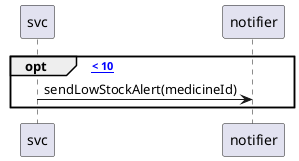

**Lỗi thường gặp:**
- Dùng `opt` nhưng lại thêm nhãn `else` bên trong — sai cú pháp, vì `opt` về định nghĩa chỉ có 1 region.
- Dùng `alt` có 2 nhánh nhưng nhánh "else" để trống (không vẽ message gì) — nên thay bằng `opt` cho rõ nghĩa và đúng chuẩn.

---

### 2.13. Combined Fragment — `loop`

| Cấp độ | Nội dung |
|---|---|
| **Ký pháp** | Khung `loop`, có thể kèm chỉ số lặp `loop [min, max]` hoặc guard điều kiện `loop [hasNext()]` |
| **Cú pháp** | Bên trong khung là tập message sẽ lặp lại; điều kiện dừng nên ghi rõ (vô hạn lặp là lỗi thiết kế) |
| **Ngữ nghĩa** | Tương đương `for`/`while` trong code |

**Ví dụ (BR-07 FIFO Dispensing — lặp qua các lô thuốc theo thứ tự nhập):**
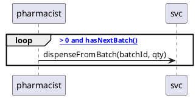

**Lỗi thường gặp:**
- Không ghi điều kiện dừng (`loop` trống) — không thể hiện rõ khi nào vòng lặp kết thúc, gây khó hiểu cho người đọc thiết kế.
- Dùng `loop` để mô tả "nhiều actor khác nhau cùng làm một hành động" (sai đối tượng lặp) — `loop` chỉ nên dùng khi cùng một cặp lifeline gửi/nhận lặp lại message, không dùng để gộp nhiều actor khác nhau.

---

### 2.14. Combined Fragment — `par` (Parallel)

| Cấp độ | Nội dung |
|---|---|
| **Ký pháp** | Khung `par`, chia nhiều region bằng đường đứt nét, **không có guard** (khác với `alt`) |
| **Cú pháp** | Tất cả các region đều được thực thi, không theo thứ tự xác định (interleaved) |
| **Ngữ nghĩa** | Các luồng xử lý chạy đồng thời/song song, độc lập với nhau |

**Ví dụ (UC-32 + gửi email hóa đơn cùng lúc với ghi log):**
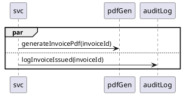

**Lỗi thường gặp:**
- Thêm guard condition `[...]` vào region của `par` — sai cú pháp, vì `par` không dùng guard (đó là đặc trưng của `alt`).
- Dùng `par` cho các bước có phụ thuộc tuần tự thực sự (ví dụ: phải lưu hóa đơn xong mới gửi email xác nhận) — sai ngữ nghĩa, nên dùng message tuần tự thông thường.

---

### 2.15. Combined Fragment — `critical` (Critical Region)

| Cấp độ | Nội dung |
|---|---|
| **Ký pháp** | Khung `critical`, một region duy nhất |
| **Cú pháp** | Không cho phép các message khác chèn vào giữa các message trong khung này khi xét đa luồng/đồng thời |
| **Ngữ nghĩa** | Đoạn xử lý phải nguyên tử (atomic), không bị gián đoạn bởi luồng thực thi khác — tương đương khối có khóa (lock/synchronized) trong code |

**Ví dụ (tránh race condition khi trừ tồn kho thuốc):**
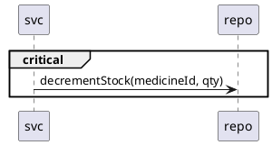

**Lỗi thường gặp:**
- Quên dùng `critical` cho các đoạn có nguy cơ race condition rõ ràng (ví dụ trừ kho, đặt lịch hẹn trùng slot) khiến thiết kế detailed design "bỏ sót" yêu cầu concurrency — vốn được nêu trong NFR (Scalability ≥ 300 concurrent users).

---

### 2.16. Combined Fragment — `break`

| Cấp độ | Nội dung |
|---|---|
| **Ký pháp** | Khung `break` với guard `[...]`, thường đặt trong một fragment lớn hơn |
| **Cú pháp** | Khi guard đúng, các message còn lại của fragment bao ngoài (enclosing fragment) bị **bỏ qua hoàn toàn** |
| **Ngữ nghĩa** | Tương đương `break`/early-return trong code — thoát sớm khỏi luồng đang xử lý |

**Ví dụ (BR-02 Account Locking):**
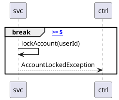

**Lỗi thường gặp:**
- Dùng `break` nhưng vẫn vẽ tiếp các message sau đó như thể luồng tiếp tục bình thường — mâu thuẫn ngữ nghĩa, vì `break` ngụ ý các bước sau bị hủy.

---

### 2.17. Interaction Occurrence — `ref` (Tham chiếu tới Sequence Diagram khác)

| Cấp độ | Nội dung |
|---|---|
| **Ký pháp** | Khung chữ nhật có nhãn `ref` ở góc trên-trái, nội dung khung là tên của một sequence diagram khác |
| **Cú pháp** | Tên tham chiếu phải khớp chính xác với tên một sequence diagram đã định nghĩa riêng; khung `ref` phải bao trùm đúng các lifeline tham gia trong diagram được tham chiếu |
| **Ngữ nghĩa** | Tái sử dụng (reuse) một luồng tương tác đã thiết kế sẵn, tránh lặp lại chi tiết — tương đương gọi một hàm con đã được thiết kế ở module khác |

**Ví dụ (UC-11 Book Appointment tham chiếu luồng xác thực chung):**
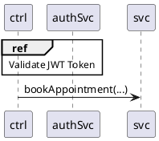

**Lỗi thường gặp:**
- Dùng `ref` để tham chiếu một diagram chưa tồn tại/chưa thiết kế — tạo "lỗ hổng" thiết kế, dễ bị bỏ quên khi review.
- Dùng `ref` cho một đoạn quá ngắn (1-2 message), không thực sự đáng để tách riêng — nên inline trực tiếp.

---

### 2.18. Guard Condition (Điều kiện bảo vệ)

| Cấp độ | Nội dung |
|---|---|
| **Ký pháp** | Biểu thức đặt trong dấu `[ ]`, đặt ở đầu mỗi region của combined fragment |
| **Cú pháp** | Phải là biểu thức boolean hợp lệ (có thể tham chiếu biến/thuộc tính đã xuất hiện trong luồng); với `alt` cần đảm bảo các guard loại trừ nhau |
| **Ngữ nghĩa** | Điều kiện được đánh giá tại runtime để quyết định region nào thực thi |

**Lỗi thường gặp:**
- Viết guard bằng ngôn ngữ tự nhiên mơ hồ ("nếu hợp lệ") thay vì biểu thức gắn với thuộc tính cụ thể ("appointment.status == PENDING") — giảm giá trị làm tài liệu kỹ thuật chính xác cho lập trình viên.

---

### 2.19. Note (Chú thích)

| Cấp độ | Nội dung |
|---|---|
| **Ký pháp** | Hình chữ nhật góc bị gấp (dog-eared rectangle), nối tới phần tử được chú thích bằng đường đứt nét, hoặc đặt `over`/`left of`/`right of` một lifeline |
| **Cú pháp** | Không ảnh hưởng tới luồng thực thi; chỉ mang tính mô tả thêm |
| **Ngữ nghĩa** | Giải thích bổ sung cho người đọc, không phải một phần hành vi của hệ thống |

**Lỗi thường gặp:**
- Nhồi logic nghiệp vụ quan trọng vào Note thay vì mô hình hóa bằng guard/fragment — khiến hành vi hệ thống "ẩn" trong text tự do, khó kiểm chứng và dễ bị bỏ sót khi sinh code.

---

## 3. Bảng tổng hợp lỗi thường gặp theo nguyên nhân gốc

| Nhóm nguyên nhân | Biểu hiện | Hậu quả |
|---|---|---|
| Nhầm ký pháp message | Dùng mũi tên đặc cho async, mũi tên que mở cho sync | Đọc sai bản chất blocking/non-blocking của lời gọi |
| Sai cú pháp combined fragment | `alt` thiếu guard, `par` có guard, `opt` có `else` | Diagram không tuân theo UML spec, công cụ CASE có thể từ chối render hoặc sinh code sai |
| Sai ngữ nghĩa nghiệp vụ | Dùng Destroy Message cho entity có quy tắc "No Hard Delete" (BR-09) | Thiết kế mâu thuẫn với business rule đã thống nhất trong SRS |
| Mất đồng bộ với Class Diagram | Tên message không khớp tên operation, gọi operation chưa tồn tại | Class Diagram và Sequence Diagram "lệch pha", gây lỗi khi code hóa |
| Lạm dụng Note để giấu logic | Đặt điều kiện rẽ nhánh quan trọng trong Note tự do | Logic nghiệp vụ không được mô hình hóa chính thức, dễ bị bỏ sót |
| Bỏ sót concurrency | Không dùng `critical` cho đoạn có race condition rõ ràng | Thiết kế detailed design không phản ánh đúng NFR về concurrency/scalability |

---

## 4. Checklist tự kiểm tra trước khi nộp Sequence Diagram

1. Mỗi lifeline có khớp với một class đã tồn tại trong Class Diagram (đúng tên, đúng kiểu)?
2. Mỗi message đồng bộ có khớp đúng tên + tham số + kiểu trả về với operation trong Class Diagram?
3. Mỗi `alt` có ít nhất 2 nhánh với guard loại trừ nhau; mỗi `opt` chỉ có 1 nhánh?
4. Có dùng đúng loại mũi tên cho sync/async/return?
5. Các business rule liên quan (BR-xx trong SRS) có được thể hiện bằng guard/fragment tương ứng, không bị giấu trong Note?
6. Nếu có rủi ro race condition (ví dụ trừ kho, đặt lịch trùng slot) đã bọc bằng `critical` chưa?
7. Lifeline bị hủy (nếu có) có tuân thủ BR-09 (No Hard Delete) — chỉ áp dụng Destroy Message cho object tạm, không áp dụng cho entity nghiệp vụ?
