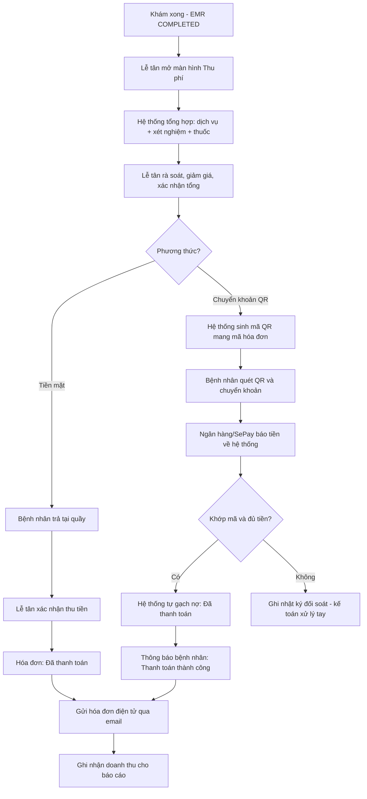

# Quy trình thanh toán — Mô tả nghiệp vụ (Business Level)

> UC-22 Process Payment / UC-23 Deliver Invoice — Nhãn Khoa Ánh Sao (ECMS)

## 1. Mục tiêu nghiệp vụ

Thu đúng, đủ chi phí một lượt khám và **giao hóa đơn điện tử** cho bệnh nhân, đảm bảo
mỗi khoản tiền vào đều được ghi nhận và đối soát — kể cả khi bệnh nhân chuyển khoản online.

## 2. Các bên tham gia (Actors)

| Bên | Vai trò nghiệp vụ |
|---|---|
| **Bệnh nhân** | Người thụ hưởng dịch vụ, người trả tiền (tiền mặt hoặc chuyển khoản). |
| **Lễ tân** | Lập & phát hành hóa đơn, thu tiền mặt, đối chiếu với bệnh nhân. |
| **Hệ thống ECMS** | Tổng hợp chi phí, sinh mã QR, gạch nợ, ghi nhận doanh thu, gửi thông báo. |
| **Ngân hàng / Cổng thanh toán (SePay)** | Nhận tiền vào tài khoản phòng khám, báo biến động số dư về hệ thống. |

## 3. Điều kiện tiên quyết

- Lượt khám đã hoàn tất (bệnh án ở trạng thái **COMPLETED**).
- Chi phí dịch vụ, thuốc, xét nghiệm đã được cấu hình giá.
- Lễ tân đã đăng nhập.

## 4. Luồng nghiệp vụ chính

### 4.1. Lập hóa đơn (chung cho mọi hình thức)

1. Lễ tân mở màn hình **Thu phí** cho lượt khám đã hoàn tất.
2. Hệ thống **tự tổng hợp khoản phí** từ dữ liệu khám:
   - **Dịch vụ khám** — dịch vụ đã đặt lịch.
   - **Xét nghiệm / cận lâm sàng** — các chỉ định chụp/đo/soi của bác sĩ.
   - **Thuốc** — đơn thuốc bác sĩ đã kê.
3. Lễ tân rà soát, thêm/bớt khoản phí, áp **giảm giá** nếu có, xác nhận tổng tiền với bệnh nhân.

### 4.2. Nhánh A — Thanh toán tiền mặt

1. Bệnh nhân trả tiền mặt tại quầy.
2. Lễ tân bấm **"Xác nhận thu tiền & Phát hành"**.
3. Hệ thống đánh dấu hóa đơn **Đã phát hành + Đã thanh toán** ngay.
4. Hệ thống **gửi hóa đơn điện tử (biên nhận) vào email** bệnh nhân.

> Ở nhánh này lễ tân cầm tiền trên tay nên chịu trách nhiệm xác nhận — không cần ngân hàng.

### 4.3. Nhánh B — Thanh toán chuyển khoản (QR / VietQR)

1. Lễ tân bấm **"Tạo mã QR & chờ chuyển khoản"**.
2. Hệ thống sinh **mã QR** mang **nội dung chuyển khoản = mã hóa đơn** (để đối soát tự động).
3. Bệnh nhân **quét QR và chuyển khoản** bằng app ngân hàng (hoặc trả từ trang "Hóa đơn của tôi").
4. Tiền vào tài khoản phòng khám → **ngân hàng/SePay báo biến động số dư** về hệ thống.
5. Hệ thống **tự dò mã hóa đơn, đối chiếu số tiền và gạch nợ** — chuyển hóa đơn sang
   **Đã thanh toán** mà **không cần lễ tân xác nhận thay ngân hàng**.
6. Hệ thống **thông báo cho bệnh nhân "Thanh toán thành công"** và gửi hóa đơn điện tử.

> Nguyên tắc: chỉ chính ngân hàng mới xác nhận "đã nhận tiền" — hệ thống không tin cú bấm
> tay để tránh đánh dấu đã trả khi tiền chưa thực sự về.

## 5. Sơ đồ luồng nghiệp vụ

## 6. Kết quả nghiệp vụ (Postconditions)

- Hóa đơn ở trạng thái **Đã thanh toán**.
- **Hóa đơn điện tử** được gửi vào email và portal bệnh nhân.
- **Doanh thu** được ghi nhận phục vụ báo cáo.
- Với chuyển khoản: **mọi giao dịch** (kể cả không khớp) đều được lưu để **đối soát** — không bao giờ mất dấu tiền.

## 7. Các tình huống ngoại lệ (Business Exceptions)

| Tình huống | Xử lý nghiệp vụ |
|---|---|
| Bệnh nhân chuyển **thiếu tiền** | Hóa đơn vẫn **chưa thanh toán**; giao dịch được ghi để kế toán đối chiếu. |
| Chuyển khoản **sai nội dung** (thiếu mã hóa đơn) | Hệ thống không tự gạch nợ; giao dịch vào danh sách **cần đối soát tay**. |
| Ngân hàng **báo trùng** một giao dịch | Hệ thống nhận diện và **không gạch nợ hai lần**. |
| Bệnh nhân **đổi ý** sang trả tiền mặt sau khi đã sinh QR | Lễ tân phát hành lại bằng phương thức tiền mặt. |
| Bệnh nhân **không có email** | Vẫn thu tiền bình thường; hóa đơn không gửi được qua email (in giấy nếu cần). |

## 8. Quy tắc nghiệp vụ liên quan

- **BR-10**: Chỉ đánh dấu "Đã thanh toán" khi đã nhận đủ tiền; thiếu tiền giữ trạng thái chờ.
- **BR-11**: Tổng thanh toán = Phí khám + Phí xét nghiệm + Phí thuốc − Giảm giá.
- **BR-09**: Không xóa cứng hóa đơn; hóa đơn bỏ đi được **hủy** (soft-cancel).
